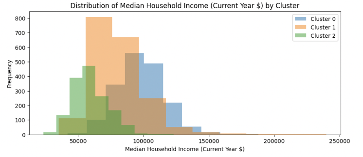

# Interior Design Market Targeting

**How do you find the most profitable region in Canada for business expansion?**

This project tackled that question for an interior design business aiming to optimize store locations and tailor product offerings to regional demand.

The analysis leveraged K-Means and BIRCH clustering techniques to segment census tract data, pinpointing lucrative areas with high demand for interior design services. Following segmentation, predictive modeling was applied to predict median household income, offering insights into regional financial conditions. 

## Step 1: Data Preparation

The dataset, sourced from Statistics Canada, provides detailed census tract-level information, with each row representing a unique census tract. It includes 18 attributes grouped into five categories: median household income (the target variable), total households and population, households categorized by dwelling structure type (e.g., houses, apartments, and others), tenure type (owners versus renters), and period of construction. 

Starting with 5,371 training and 855 test records, I removed ~2% of training rows with missing values. To enhance clustering, I analyzed input correlations and retained only essential features to minimize redundancy.

#### **Target variable** 

The median household income across census tracts ranges from \$23,400 to $240,000 annually, with an average of \$80,443.68 and a median of \$78,000.

#### **Total Households and Population**

To reduce redundancy, I removed columns duplicating *Total Households*. Given its strong correlation (0.88) with *Total Population* and the focus on households, I retained *Total Households* only. To standardize dwelling characteristics across tracts, I converted dwelling totals into percentages of total households.

#### **Households by dwelling structure type**

Dwelling structure types include houses, apartments, and others. Since *percent_house* and *percent_apartment* are highly correlated (-0.99), I retained *percent_house* and removed *percent_apartment* to reduce redundancy.

#### **Households by tenure type**

Tenure types include owners and renters, with *percent_owner* and *percent_renter* highly correlated (-0.99). Since the target audience is owners, I retained *percent_owner* and removed *percent_renter*.

#### **Households for Period of Construction**

Construction periods span pre-1961 to 2021 across eight variables with moderate correlations. Older dwellings (pre-1981) correlate negatively with *Median Household Income*, while newer ones show positive correlations. To simplify, I combined pre-1981 periods into *percent_before_81* and later ones into *percent_81_after*. Since *percent_before_81* and *percent_81_after* are highly correlated (-0.9995) and the target market is modern dwellings, I retained *percent_81_after* and removed *percent_before_81*.

#### **All Input Variables**

After carefully examining the correlations across all five categories of attributes, I refined the dataset to include five input variables, with their correlation matrix displayed. 

Among these, *Percent_house* and *percent_owner* are strongly correlated (0.86), so I retained *percent_house* and removed *percent_owner* to reduce redundancy. The final dataset includes four input variables and one numeric target variable, summarized below.

| **Input Variable** | **Meaning**                                        |
| ------------------ | -------------------------------------------------- |
| Total Households   | Total number of households                         |
| percent_house      | Percentage households for structure type houses    |
| percent_other      | Percentage households for other structure types    |
| percent_81_after   | Percentage households for constructions after 1981 |

As the final step before model fitting, Inormalized the input variable *Total Households* and the target variable *Median Household Income* using Min-Max Normalization. This step is crucial because clustering methods, such as K-Means Clustering, are highly sensitive to scaling.

## Step 2: K-Means Clustering

### 2.1 Optimal Number of Clusters

To determine the optimal K, I assessed Inertia, Silhouette Score, and the Pseudo-F statistic. Inertia showed diminishing returns from K = 2 to 6, while K = 3 achieved the highest Silhouette Score and Pseudo-F statistic, indicating well-defined, compact clusters. Thus, we selected **K = 3** to segment the census tracts.

### **2.2 Detailed Profile of the Three Clusters**

With the optimal number of clusters determined as K = 3, I applied K-Means Clustering to segment the census tracts into three distinct groups. 

#### **Aggregate Mean by Cluster**

| **Cluster** | **Median Household Income** | **Total Households** | **percent_house** | **percent_other** | **percent_81_after** |
| ----------- | --------------------------- | -------------------- | ----------------- | ----------------- | -------------------- |
| 0           | 98044.45                    | 1841                 | 83.03%            | 1.42%             | 84.29%               |
| 1           | 80525.87                    | 1605                 | 75.14%            | 1.35%             | 29.56%               |
| 2           | 59327.95                    | 2116                 | 19.98%            | 1.08%             | 41.79%               |

Cluster 0 has the highest mean for Median Household Income, while Cluster 2 has the lowest. The mean values for Total Households show minimal variation across clusters. In terms of housing types, the mean percentage of households in houses is approximately 83% in Cluster 0 but drops significantly to around 20% in Cluster 2. The mean percentage of households in other structure types is consistent across clusters at approximately 1%. Additionally, the percentage of households in dwellings built after 1981 shows substantial variation, with Cluster 0 having the highest mean at 84% and Cluster 1 the lowest at 30%. Overall, significant differences in mean values are observed for Median Household Income, percent_house, and percent_81_after across clusters. 

#### **Cluster Distribution By Variable**

I began by examining the univariate distributions of dwelling-related variables, including *percent_house, percent_other,* and *percent_81_after.* the distribution of *percent_other* overlaps significantly across clusters, while *percent_house* and *percent_81_after* exhibit clear differences between clusters. 

Next, I explored the multivariate distribution of the key dwelling-related variables *percent_house* and *percent_81_after.* Cluster 1 has a high percentage of households in houses but a low percentage of households in modern dwellings. Cluster 0 combines a high percentage of households in houses with a high percentage in modern dwellings. On the other hand, Cluster 2 is marked by a low percentage of households in houses and shows no distinct pattern regarding the percentage of households in modern dwellings. 

Then, I analyzed the univariate distributions of *Total Households* and *Median Household Income.* The distribution of *Total Households* exhibits considerable overlap across clusters, indicating minimal variation. In contrast, *Median Household Income* demonstrates significant differences between clusters. Cluster 2 predominantly contains values below $100,000, Cluster 1 represents middle-income values, and Cluster 0 comprises high-income values.

#### **Defining the Clusters**

- **Cluster 0: High-Income Modern Communities:** Census tracts in this cluster are characterized by high median household income, with most households living in houses and modern dwellings.

- **Cluster 1: Middle-Income Traditional Communities: **Census tracts in this cluster have a middle-range median household income. Households primarily reside in houses, but the dwellings tend to be older.

- **Cluster 2: Low-Income Mixed Communities:** Census tracts in this cluster are defined by low median household income, with relatively few households living in houses.

Clusters 0 and 1 offer profitability opportunities for interior design. Cluster 0, with high median income and modern dwellings, suggests demand for luxury furniture and premium design. Cluster 1, with mid-range income and older homes, indicates a market for renovation and modernization.

## Step 3: BIRCH Clustering

I performed clustering with 3 clusters using the BIRCH algorithm to compare its results with K-Means Clustering. When the threshold was set to 0.35 and the branching factor to 3, the BIRCH model achieved its highest Silhouette score of 0.39. With the optimal threshold and branching factor selected, the BIRCH algorithm produces cluster outcomes closely aligned with those of K-Means Clustering, confirming the reliability of the cluster profiles developed in Step 2.

## Step 4: Predictive Modeling

### 4.1 Model Fitting

I will test **CART**, **KNN**, and **Neural Network** models on the clustered data to find the optimal predictor, measured by the lowest MAE.

#### Approach:

1. Split the train set (80% train, 20% validation) and set aside the test data.
2. Train a global model with hyperparameter tuning and evaluate MAE on validation data.
3. Perform segmentation modeling:
   - Train separate models for each cluster, splitting data into train/validation subsets.
   - Assess each cluster’s model using validation data and record MAE.
   - Calculate the weighted average MAE across clusters based on sample sizes.
4. Compare MAE scores of the global and segmented models to determine the best approach.

### 4.2 Model Comparison

####  **CART Model**

The tuned global model achieved a Mean Absolute Error (MAE) of 0.0527. While the global model performed well, segmentation modelling yielded a slightly lower MAE of **0.0526**, highlighting the potential benefits of clustering for improved predictive accuracy.

| **Model (CART)**                  | **Metric (MAE)** |
| --------------------------------- | ---------------- |
| Global Model                      | 0.0527           |
| Segmentation Model - Cluster 0    | 0.0505           |
| Segmentation Model - Cluster 1    | 0.0648           |
| Segmentation Model - Cluster 2    | 0.0417           |
| Segmentation Model - Weighted Sum | **0.0526**       |

#### **ANN Model**

The tuned global ANN model achieved an MAE of 0.0513. The segmentation performs differently among different clusters. ANN performs well on cluster0 and cluster2, achieving 0.0501 and 0.0412 respectively. However, cluster 1 only has 0.0635, pushing the weighted MAE for the segmentation model up to **0.0524**. So, if I want to use a segmentation model, we would use ANN only for cluster0 and cluster2 and could choose another model which performs better on cluster1. 

| **Model (ANN)**                   | **Metric (MAE)** |
| --------------------------------- | ---------------- |
| Global Model                      | 0.0513           |
| Segmentation Model - Cluster 0    | 0.0501           |
| Segmentation Model - Cluster 1    | 0.0635           |
| Segmentation Model - Cluster 2    | 0.0412           |
| Segmentation Model - Weighted Sum | **0.0524**       |

#### **K-nearest Neighbours**

The tuned global model achieved a Mean Absolute Error (MAE) of 0.0514. The MAE for cluster0 model, cluster1 model, and cluster2 model are 0.0511, 0.0640, and 0.0404 respectively. This results in a weighted average MAE of **0.0527**, which is slightly higher than the MAE for the global model. 

| **Model (KNN)**                   | **Metric (MAE)** |
| --------------------------------- | ---------------- |
| Global Model                      | 0.0514           |
| Segmentation Model - Cluster 0    | 0.0511           |
| Segmentation Model - Cluster 1    | 0.0640           |
| Segmentation Model - Cluster 2    | 0.0404           |
| Segmentation Model - Weighted Sum | **0.05247**      |

#### **Comparison and Final Remarks**

The three models showed similar performance overall. Based on cluster-specific results, an Artificial Neural Network (ANN) is recommended for predicting median household income in Clusters 0 and 1, while a K-Nearest Neighbors (KNN) model is best for Cluster 2.
